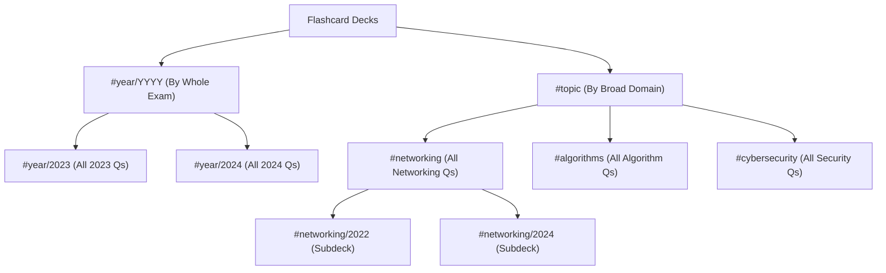

# PelNETS Exam Organization & Sorting Guide

This document details how past examination papers, topics, and flashcards are structured and sorted across the **PelNETS** ecosystem (Obsidian vault, filesystem, and the web reviewer application).

---

## 1. Filesystem & Naming Hierarchy

At the folder level, questions are partitioned by **Exam Year**, and each individual file name strictly identifies the exam year, season, paper type, and question number.

```text
pelnets/
├── 2007/
│   ├── 2007S_FE_1.md
│   └── ...
├── 2023/
│   ├── 2023A_FE_AM_1.md
│   ├── 2023S_FE-A_80.md
│   └── ...
├── 2024/
│   ├── 2024S_FE-A_1.md
│   ├── 2024S_FE-B_1.md
│   └── ...
├── 2026/
│   └── ...
└── Files/   <-- Extracted diagrams, schematics, circuits, and question screenshots
```

### File Naming Convention

`{Year}{Season}_FE_{Paper}_{QuestionNumber}.md` *(or `{Year}{Season}_FE-{Paper}_{QuestionNumber}.md`)*

* **Year:** `2007` through `2026`.
* **Season Code:**
  * **`S`** = **Spring / April** examination (e.g. `2024S`)
  * **`A`** = **Autumn / October** examination (e.g. `2024A`)
* **Paper Type:**
  * **Pre-2023 Examinations:**
    * **`AM`** = Morning Paper (General IT fundamentals, multiple-choice Q1–Q80)
    * **`PM`** = Afternoon Paper (Scenario-based case studies with subquestions, e.g. `2012S_FE_PM_1_1.md`)
  * **2023+ Examinations (New Format):**
    * **`FE-A`** = Subject A (Fundamental IT knowledge & concepts)
    * **`FE-B`** = Subject B (Algorithms, pseudo-code, data structures, and Information Security)
* **Question Number:** Sequential question order in that paper (e.g., `_1` to `_80`).

---

## 2. Frontmatter Tagging & 3-Way Deck Sorting

In every Markdown note, YAML frontmatter defines the deck organization using standard tag pairs:

```yaml
---
created: 2024-04-21 10:00
status: "#philnits"
tags:
  - networking/2024
  - year/2024
---
```

Because the Obsidian Spaced Repetition plugin treats `/` as a subdeck divider, this dual-tag structure creates a **simultaneous 3-way deck hierarchy**:



### The 3 Study Views:
1. **By Whole Exam Year (`#year/YYYY`):**
   * Groups **all questions from a single year** into one deck (e.g., `#year/2024`), allowing full mock exams regardless of subject.
2. **By Broad Subject Category (`#<category>`):**
   * Rolls up all sub-tags into the parent deck (e.g., `#networking`), allowing targeted study across all years (2007–2026).
3. **By Topic within an Exam Year (`#<category>/YYYY`):**
   * Forms subdecks (e.g., `#networking/2024`), allowing review of how a specific domain appeared in a given exam paper.

---

## 3. Directory of 30 Standardized Categories

PelNETS maps every question strictly into **30 registered topic tags** (defined in `Registered_Categories.md`):

| Category Tag | Scope & Key Concepts |
|---|---|
| `#accounting` | Balance sheets, profit calculation, P/L statements, break-even point. |
| `#algorithms` | Sorting, searching, recursion, graph traversal, Euclidean GCD, $O(n)$ complexity. |
| `#artificial-intelligence` | Machine learning, deep learning, neural networks, NLP, LLMs, computer vision. |
| `#automata-theory` | State machines, state transition diagrams, DFAs, NFAs, regular grammars. |
| `#business-administration` | Business strategy, corporate governance, HR, procurement, contracts, BPR, TQM. |
| `#cloud-computing` | IaaS, PaaS, SaaS, public/private/hybrid cloud, multi-tenant architecture. |
| `#cybersecurity` | Information security, symmetric/asymmetric encryption, hashes, malware, firewalls, CIA triad. |
| `#data-encoding` | Compression (Huffman, Run-length), parity bits, check digits, character sets. |
| `#data-structures` | Stacks, queues, linked lists, binary trees, heaps, hash tables, graphs. |
| `#devops` | CI/CD, automated provisioning, containerization (Docker, Kubernetes). |
| `#digital-logic` | Boolean algebra, truth tables, Karnaugh maps, logic gates (AND/OR/XOR), flip-flops. |
| `#hardware` | CPU architecture, cache hierarchy, pipelining, interrupts, storage (HDD, SSD), RAID. |
| `#information-management` | Relational databases, SQL queries, normalization (1NF–3NF), ACID transactions. |
| `#math` | Arithmetic, linear equations, matrices, basic algebra word problems. |
| `#networking` | OSI 7 layers, TCP/IP, IP addressing, subnetting, CIDR, DNS, ARP, routing protocols. |
| `#number-systems` | Binary/octal/hex conversions, IEEE 754 floating-point, two's complement. |
| `#object-oriented-programming` | Classes, objects, inheritance, polymorphism, encapsulation, method overriding. |
| `#operating-systems` | CPU scheduling, virtual memory, paging, thrashing, deadlocks, process states. |
| `#probability` | Independent events, conditional probability, Bayes' theorem, queuing models ($M/M/1$). |
| `#programming` | Variables, loops, scoping, pointers, syntax, data types, parameter passing. |
| `#project-management` | Scrum, Agile, Waterfall, Gantt charts, CPM / PERT, critical path, WBS, EVM. |
| `#service-management` | ITIL, SLA, incident management, change management, system reliability. |
| `#sets` | Set operations (union, intersection, complement), Venn diagrams. |
| `#software` | General software tools, utilities, office suites, presentation tools. |
| `#software-engineering` | SDLC models, design patterns, UML diagrams, requirements engineering, CMMI. |
| `#software-testing` | Unit/integration/system testing, black-box/white-box testing, boundary value analysis. |
| `#statistics` | Mean, median, mode, standard deviation, normal distribution, correlation. |
| `#systems-architecture` | Topologies, client-server, microservices, system availability ($R = 1 - (1-r)^2$). |
| `#web-technologies` | HTML, CSS, JavaScript, DOM, REST APIs, JSON, AJAX, cookies, sessions. |
| `#year` | Special organizational tag grouping all questions for a specific year (e.g. `#year/2024`). |

---

## 4. How the Web App (`pelnets.vercel.app`) Sorts Questions

In the web application, a build script parses these frontmatter tags and metadata into structured JSON records:

* **Decks Hub (`/decks`):**
  * **Group by Topic:** 30 category cards showing question count and progress.
  * **Group by Year:** Chronological list of all exam years from 2026 down to 2007.
* **Browse Directory (`/browse/:year`):**
  * Sequential browse ordered by: `Year` $\to$ `Season` $\to$ `Paper (A/B or AM/PM)` $\to$ `Question Number (1–80)`.
* **Spaced Repetition Review Queue (`/review/srs`):**
  * Dynamically sorted by retrievability and due date, prioritizing overdue items and weak categories.
