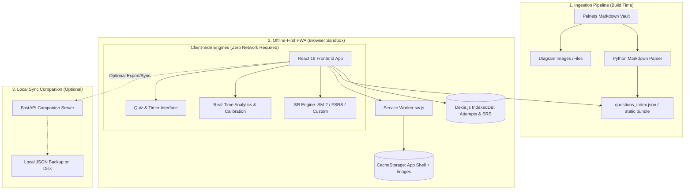

# **Implementation Plan - SLACKR: PHILNITS Exam Reviewer**

## **Problem Statement:**
Create an offline-first PHILNITS exam reviewer application that provides comprehensive analytics and weakness tracking beyond existing solutions. The app must parse questions from the pelnets repository and provide detailed performance metrics including error rates by topic, spaced repetition with multiple algorithms, time tracking, and confidence calibration to help users identify and improve weak areas.

---

## **Requirements:**

### **Data & Storage**
- Clone and parse pelnets repository markdown files (Obsidian format with YAML frontmatter)
- **Zero-Backend Offline Runtime:** Study materials pre-indexed into static JSON/bundle for instant offline execution
- **Local-First Client Database (IndexedDB via Dexie.js):** User attempts, review history, and SRS intervals stored locally in the browser sandbox for 100% offline persistence without server dependency
- **Multi-Tier Service Worker & CacheStorage:** Pre-caches application shell, KaTeX fonts, and maintains a persistent cache for diagram images (`Files/`)
- **Offline Image Sync:** One-click option in Settings to download all exam diagrams for complete offline review on mobile or desktop
- User statistics exportable to and importable from local JSON files

### **Navigation Structure**
- **Tab 1:** Browse by exam year (2007 through 2026)
- **Tab 2:** Browse by topic category (30 topics: networking, algorithms, databases, etc.)
- **Tab 3:** Combined filters (year AND topic simultaneously)
- **Tab 4:** Custom quiz builder (user-selected questions)

### **Spaced Repetition System**
- Three selectable algorithms: SM-2, FSRS, Custom
- Real-time analytics updates after each question (computed directly in client database)
- User can switch algorithms at any time with automatic historical attempt replay

### **Analytics & Tracking Features**
1. **Error rate by topic** - Percentage of incorrect answers per category
2. **Priority weak spots** - Topics ranked by error rate and recency
3. **Consistency score** - Performance stability over time
4. **Confidence calibration** (pre-reveal) - User rates confidence BEFORE submitting answer
5. **Learning gain** - Improvement metrics over time periods
6. **Spaced repetition scheduling** - Next review dates per question
7. **Topic weakness heatmap** - Visual grid of topic performance over time
8. **Time average per topic** - Mean time spent on each category
9. **Time per specific question** - Individual question timing
10. **Overall history per question** - Full chronological list of all attempts showing:
    - Date and time of attempt
    - Correct/incorrect result
    - Time question was open
    - Confidence rating (if enabled)

### **User Interface**
- Minimalistic design with clean component library
- Tables and lists with sortable columns and filtering
- Responsive layout for desktop and mobile
- PWA installable as standalone desktop/mobile app ("Add to Home Screen")

### **Technical Stack**
- **Ingestion & Data Tool:** Python (PyMuPDF, python-frontmatter, FastAPI optional companion)
- **Frontend Framework:** React 19 + TypeScript with Bun / Vite
- **PWA & Offline System:** Custom Service Worker (`sw.js`), Web App Manifest (`manifest.json`), and CacheStorage API
- **Local Database (Client):** Dexie.js (IndexedDB wrapper) for zero-latency, local-first attempt storage
- **Styling:** Tailwind CSS with dark-mode first design system
- **State Management:** Zustand (lightweight UI state) + Dexie LiveQuery / React hooks
- **Math & Markdown:** KaTeX (`katex`, `remark-math`, `rehype-katex`) for LaTeX equations
- **Data Visualization:** TanStack Table for sortable tables and lightweight SVG/Canvas heatmaps

---

## **Background Research:**

### **Markdown Structure (pelnets)**
Questions follow this format:
```yaml
---
created: YYYY-MM-DD HH:mm
status: "#philnits"
tags:
  - category/YYYY
  - year/YYYY
---

# QuestionID

[Question text with options a, b, c, d]
?
[Correct answer]
[Explanation with LaTeX and images]
---
```

### **Spaced Repetition Algorithms**

**SM-2 Algorithm:**
- Tracks: repetition number (n), easiness factor (EF), interval (I)
- Grades: 0-5 (0=complete failure, 5=perfect recall)
- Formula: I = I × EF (with adjustments based on grade)
- Simple, proven, widely used (Anki, Mnemosyne)

**FSRS (Free Spaced Repetition Scheduler):**
- Modern machine learning-based algorithm
- More accurate than SM-2 for predicting retention
- Uses memory state model with retrievability and stability
- Requires training on user data for optimization
- Supported natively in Anki 23.10+

**Custom Algorithm (to design):**
- Can incorporate weakness metrics specific to SLACKR
- Weight by topic priority and error rate
- Adjust intervals based on confidence calibration
- Factor in time-to-answer as difficulty indicator

### **Python Libraries for Implementation**
- **Markdown parsing:** `python-frontmatter` (YAML + content) or `markdown-it-py`
- **File system operations:** `pathlib` (built-in)
- **Web framework:** FastAPI (async, modern) or Flask (simpler)
- **JSON handling:** `json` (built-in)
- **Date/time:** `datetime` (built-in)

### **React/Bun Libraries**
- **UI Components:** shadcn/ui (minimalist, customizable) or Radix UI
- **Tables:** TanStack Table (formerly React Table) - sorting, filtering, pagination
- **State Management:** Zustand (lightweight) or React Context
- **Styling:** Tailwind CSS (utility-first, minimalist)
- **Routing:** React Router
- **Charts (optional for heatmaps):** Recharts or Chart.js
- **Date handling:** date-fns

---

## **Proposed Solution:**

### **Architecture Overview**



### **Offline-First Data Flow**
1. **Pre-Compilation:** Python parser reads the 3,600+ vault markdown notes and produces a compressed `questions_index.json` static asset.
2. **First Load & PWA Install:** The Service Worker (`sw.js`) installs and caches all core bundles, KaTeX fonts, and application routes. User can install as a standalone PWA.
3. **Offline Image Sync (Settings):** User clicks "Sync Images for Offline Use" in Settings, which downloads exam diagram images into persistent `CacheStorage` (`philnits-images-v1`).
4. **Quiz Session (100% Offline):** Questions load from memory/cache. The user answers, selects pre-reveal confidence, and views KaTeX explanations.
5. **Local-First Persistence:** Every attempt, duration, confidence, and updated SRS schedule is written directly to the client's **IndexedDB via Dexie.js** in milliseconds.
6. **Instant Analytics:** Analytics (weak spots, heatmaps, learning gains) are computed client-side using Dexie queries without network latency or server load.

### **JSON Data Structures**

**Questions Index (`questions_index.json`):**
```json
{
  "2024S_FE-A_1": {
    "id": "2024S_FE-A_1",
    "year": "2024",
    "season": "S",
    "paper": "FE-A",
    "number": 1,
    "tags": ["number-systems/2024", "year/2024"],
    "topics": ["number-systems"],
    "question": "What is the decimal representation...",
    "options": {"a": "83.25", "b": "83.5", "c": "291.25", "d": "291.5"},
    "correct": "c",
    "explanation": "Step 1: Convert...",
    "image_path": null
  }
}
```

**User Statistics (`user_stats.json`):**
```json
{
  "settings": {
    "spaced_repetition_algorithm": "SM-2",
    "confidence_tracking_enabled": true
  },
  "question_history": {
    "2024S_FE-A_1": {
      "attempts": [
        {
          "timestamp": "2024-01-15T10:30:00",
          "answer": "c",
          "correct": true,
          "time_seconds": 45,
          "confidence": 4
        }
      ],
      "sr_data": {
        "algorithm": "SM-2",
        "n": 1,
        "ef": 2.5,
        "interval": 1,
        "next_review": "2024-01-16T10:30:00"
      }
    }
  },
  "topic_stats": {
    "number-systems": {
      "total_attempts": 10,
      "correct_attempts": 7,
      "total_time_seconds": 450,
      "last_attempt": "2024-01-15T10:30:00"
    }
  }
}
```

**Dexie.js Client Database Schema (`src/db/schema.ts`):**
```typescript
export interface AttemptRecord {
  id?: number;
  questionId: string;
  topic: string;
  selectedAnswer: string;
  isCorrect: boolean;
  timeSeconds: number;
  confidence: number; // 1-5 pre-reveal confidence
  timestamp: string;
}

export interface SRScheduleRecord {
  questionId: string;
  algorithm: 'SM-2' | 'FSRS' | 'Custom';
  repetitionNumber: number;
  easinessFactor: number;
  stability?: number;
  difficulty?: number;
  intervalDays: number;
  nextReviewDate: string;
}

export interface TopicStatRecord {
  topic: string;
  totalAttempts: number;
  correctAttempts: number;
  totalTimeSeconds: number;
  lastAttempt: string;
}

// Dexie Schema Definition:
// db.version(1).stores({
//   attempts: '++id, questionId, topic, isCorrect, timestamp, confidence',
//   srSchedules: 'questionId, algorithm, nextReviewDate, intervalDays',
//   topicStats: 'topic, lastAttempt',
//   settings: 'key'
// });
```

---

## **Task Breakdown:**

### **Task 1: Project Setup and Repository Structure**
**Objective:** Initialize the project with proper folder structure, dependencies, and version control.

**Implementation:**
- Create root project directory with separate `backend/` and `frontend/` folders
- Initialize Python virtual environment and install: FastAPI, uvicorn, python-frontmatter, python-dotenv
- Initialize Bun project in frontend with: React, React Router, Tailwind CSS, TanStack Table, Zustand
- Create `.gitignore` for both Python and Node projects
- Set up environment configuration files
- Create basic README with setup instructions
- Clone pelnets repository into `backend/data/pelnets/`

**Testing:**
- Verify Python backend starts with `uvicorn main:app --reload`
- Verify React frontend starts with `bun dev`
- Confirm pelnets repo is cloned and accessible

**Demo:** Both backend and frontend servers run successfully on localhost, pelnets data is present in backend/data folder.

---

### **Task 2: Markdown Parser and Question Index Generator**
**Objective:** Parse all pelnets markdown files (2007–2026) and generate a structured JSON index supporting both text-choice and image-embedded questions.

**Implementation:**
- Create `backend/parsers/markdown_parser.py` module
- Use `python-frontmatter` to extract YAML metadata (`tags`, `status`, `created`)
- Parse flashcard question and explanation using the delimiter `?` and terminator `---`
- **Support Dual Question Modes:**
  - **Text-Choice Mode:** Extract question stem and parse out textual options (`a`, `b`, `c`, `d`).
  - **Image-First Mode (Diagram/Complex Questions):** When options are embedded in screenshots rather than typed text, store `options: []`, identify question diagrams, and flag `is_image_based: true`.
- **Normalize Wikilink & Markdown Images:** Convert Obsidian Wikilink syntax (`![[filename.png]]` or `![[Files/filename.png]]`) and relative markdown links into normalized web asset paths (`/files/filename.png`)
- Support extended choices (e.g., `a` through `h` for PM / Subject B fill-in-the-blank pseudo-code questions)
- Walk through all year directories (**2007 through 2026**) across AM, PM, FE-A, and FE-B exams
- Generate `backend/data/questions_index.json`
- Create script `backend/scripts/generate_index.py` with progress tracking and validation reports
- Add robust error handling for encoding quirks, nested LaTeX containing `?`, and malformed notes

**Testing:**
- Run parser on both text questions and image-only questions; verify JSON output structure
- Parse entire 3,600+ question vault and assert all questions are successfully indexed
- Verify that Wikilinks correctly convert to accessible asset URLs
- Test edge cases: PM subquestions, equations containing `?`, multiple topic tags

**Demo:** Run `python scripts/generate_index.py` and verify `questions_index.json` indexes all questions across 2007–2026 with correct image references, topics, and option structures.

---

### **Task 3: FastAPI Backend - Question Serving & Static Asset Endpoints**
**Objective:** Create REST API endpoints to serve question data and mount static file directories for exam diagram images.

**Implementation:**
- Create `backend/main.py` with FastAPI app
- **Mount Static Assets:** Mount `backend/data/pelnets/Files` via `FastAPI.staticfiles.StaticFiles` at `/files` so the frontend can directly load all question screenshots and diagrams
- Load `questions_index.json` in memory at startup for zero-latency retrieval
- Implement endpoints:
  - `GET /api/questions` - Paginated question list with optional filtering (year, topic, has_images)
  - `GET /api/questions/{question_id}` - Get full question detail, options, and explanation
  - `GET /api/years` - List all available exam years (sorted dynamically from index)
  - `GET /api/topics` - List all 30 registered categories with question counts
  - `GET /api/questions/by-year/{year}` - Filter questions by year
  - `GET /api/questions/by-topic/{topic}` - Filter questions by topic
  - `POST /api/questions/custom` - Fetch multiple questions by an array of question IDs
  - `GET /api/health` - Service health status and loaded question count
- Configure CORS middleware allowing frontend origin (`http://localhost:5173` / `http://localhost:3000`)
- Add Pydantic response models and validation for client requests

**Testing:**
- Test question filtering by year and topic via curl/Postman
- Verify static image loading: request an image like `/files/2007S_FE_AM_Q1_full.png` and verify HTTP 200 with image headers
- Benchmark latency of in-memory question lookups
- Test error responses for non-existent question IDs and invalid filter values

**Demo:** Use curl to fetch a year's questions and successfully fetch an embedded diagram image via `/files/{image_name}`.

---

### **Task 4: Local-First Client Storage Engine (Dexie.js / IndexedDB) & Statistics Service**
**Objective:** Implement a 100% offline, zero-latency local-first client storage layer using Dexie.js (IndexedDB) with optional disk/JSON synchronization.

**Implementation:**
- Create `src/db/index.ts` using **Dexie.js** with indexed schema:
  ```typescript
  class SlackrDatabase extends Dexie {
    attempts!: Table<AttemptRecord, number>;
    srSchedules!: Table<SRScheduleRecord, string>;
    topicStats!: Table<TopicStatRecord, string>;
    settings!: Table<SettingRecord, string>;
    // schema:
    // attempts: '++id, questionId, topic, isCorrect, timestamp, confidence'
    // srSchedules: 'questionId, algorithm, nextReviewDate, intervalDays'
    // topicStats: 'topic, lastAttempt'
    // settings: 'key'
  }
  ```
- Build repository services in `src/services/statsDb.ts` to:
  - Record attempts immediately to IndexedDB (zero network latency, works completely offline)
  - Compute real-time topic statistics and consistency scores directly on the client
  - Update Spaced Repetition scheduling records locally
- Implement companion synchronization module:
  - `src/services/syncService.ts`: Periodically or on-demand push/pull stats to the companion FastAPI backend (`POST /api/stats/sync` / `GET /api/stats/export`) when connected
  - Keep `user_stats.json` on disk as a portable backup
- Create reactive hooks with `useLiveQuery` from `dexie-react-hooks` so analytics and badge counters automatically update immediately when an answer is submitted

**Testing:**
- Submit 100 test attempts into Dexie.js and measure write latency (<5ms per attempt)
- Query topic aggregates and verify accuracy
- Verify data persists across browser restarts and offline page reloads
- Test sync between IndexedDB and FastAPI/disk when the local backend is started

**Demo:** Answer questions with DevTools Network set to "Offline", verify attempts are written instantaneously to IndexedDB, and observe session statistics update in real-time.

---

### **Task 5: Spaced Repetition - SM-2 Algorithm Implementation**
**Objective:** Implement SM-2 spaced repetition algorithm with scheduling logic.

**Implementation:**
- Create `backend/algorithms/sm2.py` with SM-2 algorithm class
- Implement algorithm following Wikipedia specification:
  - Track n (repetition number), EF (easiness factor), I (interval)
  - Update function accepting grade (0-5)
  - Calculate next review date
- Integrate with stats_service to store SR data per question
- Create endpoint:
  - `GET /api/spaced-repetition/due` - Get questions due for review
  - `POST /api/spaced-repetition/grade` - Submit grade and update schedule
- Add SR data to user_stats.json structure
- Filter questions by due date based on current time

**Testing:**
- Unit test SM-2 calculations with known inputs/outputs
- Test full flow: answer question → grade → next review date calculated
- Verify due questions filter returns correct questions

**Demo:** Complete a question with grade 4, show updated SR data in JSON (n, EF, I, next_review), then query due questions to verify scheduling.

---

### **Task 6: Spaced Repetition - FSRS Algorithm Implementation & Migration**
**Objective:** Implement the Free Spaced Repetition Scheduler (FSRS) using the standard FSRS-4.5/5 model and enable seamless historical migration between algorithms.

**Implementation:**
- Create `backend/algorithms/fsrs.py` wrapping the standard `fsrs` Python package (`pip install fsrs`) to ensure mathematically rigorous retention curves
- Model memory states tracking:
  - Stability ($S$): duration in days that a memory can survive with specified retention
  - Difficulty ($D$): inherent complexity of the flashcard item (1–10 scale)
  - Retrievability ($R$): probability of recall at elapsed time $t$: $R(t) = (1 + F \cdot t/S)^{-w}$
- Support standard 4-point rating grades: `1 = Again`, `2 = Hard`, `3 = Good`, `4 = Easy`
- Configure desired target retention (default: `0.90` / 90% recall probability)
- **Historical Replay Migration:**
  - Build `recompute_schedule_with_algorithm()` in stats service
  - When the user switches algorithms in Settings (e.g., SM-2 → FSRS or vice versa), replay all historical attempt logs (timestamp + rating) through the new scheduler to generate updated review intervals without losing history
- Integrate with statistics storage and expose algorithm switching parameter across SR endpoints

**Testing:**
- Unit test FSRS interval calculations across varied review histories
- Verify interval divergence between SM-2 and FSRS for difficult cards
- Test migration replay: simulate 50 attempts recorded under SM-2, switch to FSRS, and verify valid updated memory states ($S, D, R$)

**Demo:** Switch to FSRS in settings, complete questions with 4-button rating (Again/Hard/Good/Easy), show Stability and Difficulty parameters updated in storage, and inspect next scheduled review dates.

---

### **Task 7: Spaced Repetition - Custom Algorithm Implementation**
**Objective:** Implement custom spaced repetition algorithm incorporating weakness metrics.

**Implementation:**
- Create `backend/algorithms/custom.py` with custom algorithm
- Design algorithm that factors in:
  - Base interval from SM-2 logic
  - Topic error rate multiplier (weaker topics → shorter intervals)
  - Confidence score (if enabled) → adjust interval
  - Time-to-answer as difficulty indicator
- Create weighted priority score for question ordering
- Implement adaptive intervals based on consistency score
- Integrate with stats_service
- Reuse endpoints with algorithm selection

**Testing:**
- Test custom algorithm with various scenarios (weak topics, fast answers, low confidence)
- Compare intervals against SM-2 and FSRS
- Verify weak topics are prioritized correctly

**Demo:** Complete questions in a weak topic, show custom algorithm shortens intervals compared to SM-2/FSRS, demonstrating adaptive behavior.

---

### **Task 8: Analytics Calculator - Core Metrics**
**Objective:** Implement backend calculations for all analytics metrics.

**Implementation:**
- Create `backend/services/analytics_service.py`
- Implement metric calculations:
  - **Error rate by topic:** (incorrect / total) per topic
  - **Priority weak spots:** Sort topics by error rate + recency weight
  - **Consistency score:** Standard deviation of recent performance
  - **Learning gain:** Compare error rates between time periods
  - **Time averages:** Mean time per topic and per question
- Create endpoints:
  - `GET /api/analytics/error-rates` - Error rates by topic
  - `GET /api/analytics/weak-spots` - Priority weak topics
  - `GET /api/analytics/consistency` - Consistency scores
  - `GET /api/analytics/learning-gain` - Improvement metrics
  - `GET /api/analytics/time-stats` - Time-based statistics
- Calculate real-time (read from user_stats.json on each request)

**Testing:**
- Create test dataset with known statistics, verify calculations
- Test edge cases: no attempts, single attempt, perfect scores
- Validate statistical formulas

**Demo:** Submit attempts across multiple topics with varying success rates, then fetch analytics endpoints showing calculated error rates, weak spots, and time statistics.

---

### **Task 9: Analytics Calculator - Advanced Metrics**
**Objective:** Implement pre-reveal confidence calibration and multi-dimensional topic weakness heatmap calculations.

**Implementation:**
- Extend `analytics_service.py` with:
  - **Pre-Reveal Confidence Calibration Engine:**
    - Analyzes confidence ratings recorded *prior* to seeing answers (eliminating hindsight bias)
    - Computes Calibration Accuracy / Brier Score measuring probability alignment
    - Computes **Overconfidence Index:** Percentage of attempts with high confidence (Level 4–5 / "Certain") that resulted in incorrect answers
    - Computes **Underconfidence Index:** Percentage of attempts with low confidence (Level 1–2 / "Guess") that resulted in correct answers
    - Calibration Curve grouping: Observed accuracy vs. expected accuracy across confidence bins
  - **Topic Weakness Heatmap Matrix:**
    - Generates 2D matrix structured as:
      `{topic: [{period_start: "YYYY-MM-DD", error_rate: float, attempt_count: int, avg_time_sec: float}]}`
    - Supports bucket intervals by day, week, or month across all 30 exam topics
- Create endpoints:
  - `GET /api/analytics/confidence-calibration` - Calibration curve, overconfidence/underconfidence rates, and accuracy correlation
  - `GET /api/analytics/heatmap?interval=week` - Matrix for rendering the topic weakness heatmap
- Gracefully handle cases where confidence tracking is disabled or datasets are sparse

**Testing:**
- Test calibration calculations against synthetic test vectors with known overconfidence/underconfidence distributions
- Verify heatmap aggregation accurately groups attempts by time buckets and handles empty periods
- Test API responses when confidence tracking is toggled off

**Demo:** Submit attempts with pre-answer confidence ratings, fetch `/api/analytics/confidence-calibration` showing calibration curve and overconfidence percentage, and fetch heatmap payload showing error rates mapped across 30 topics over time.

---

### **Task 10: React Frontend - Project Structure, Routing & PWA Service Worker**
**Objective:** Set up React application structure, client-side routing, and a multi-tier PWA Service Worker for offline operation.

**Implementation:**
- Create folder structure:
  - `src/components/` - Reusable UI components
  - `src/pages/` - Page components for each tab
  - `src/db/` - Dexie.js local database schema and queries
  - `src/services/` - Data loading and companion sync services
  - `src/store/` - Zustand state management
  - `src/utils/` - Helper functions
  - `public/` - Static assets, icons, and PWA files
- Install and configure Tailwind CSS
- **PWA Service Worker (`public/sw.js`):**
  - Implement dual-cache architecture modeled after PelNETS:
    - `CACHE_NAME`: Pre-caches core App Shell (`/index.html`, React bundles, KaTeX fonts, icons)
    - `IMAGE_CACHE_NAME`: Dedicated persistent cache (`slackr-images-v1`) for exam diagrams (`/files/*`)
  - Fast navigation handler: network race with 4-second timeout, falling back directly to cached `/index.html`
  - Fetch handler: serves cached assets offline and automatically caches fetched diagrams
- **Web App Manifest (`public/manifest.json`):**
  - Configure `name: "SLACKR"`, `short_name: "SLACKR"`, `display: "standalone"`, `theme_color: "#0f172a"`
  - Provide 192x192 and 512x512 app icons for mobile and desktop home screen installation
- Set up React Router with routes:
  - `/` - Home/Dashboard
  - `/quiz/year` - Quiz by year (Tab 1)
  - `/quiz/topic` - Quiz by topic (Tab 2)
  - `/quiz/combined` - Combined filters (Tab 3)
  - `/quiz/custom` - Custom builder (Tab 4)
  - `/quiz/srs` - Spaced repetition review mode
  - `/analytics` - Analytics dashboard
  - `/settings` - Settings page
- Create basic Layout component with navigation tabs and PWA offline indicator banner
- Set up Zustand store for global UI state

**Testing:**
- Test routing navigation across all pages while connected
- Verify Service Worker registers successfully in Application tab of DevTools
- Test offline mode: Toggle DevTools Network to "Offline" and refresh page; assert app shell loads with no network errors
- Verify manifest is detected and "Install App" prompt is available in Chrome/Edge

**Demo:** Register Service Worker, disconnect internet, refresh page to show app shell loading instantly from CacheStorage, and display working navigation.

---

### **Task 11: Quiz Interface - Question Display Component & KaTeX Math Rendering**
**Objective:** Create reusable question display supporting LaTeX math equations, dual text/image layouts, and pre-answer confidence calibration.

**Implementation:**
- Create `src/components/QuestionCard.tsx`
- **KaTeX & Markdown Math Integration:**
  - Install and configure `katex`, `remark-math`, and `rehype-katex` along with `katex/dist/katex.min.css`
  - Render inline formulas (`$...$`) and display blocks (`$$...$$`) for mathematical, logical, and hex/binary notation
- **Dual Layout Rendering:**
  - **Text-Mode Questions:** Display parsed question markdown text with interactive options (`a`, `b`, `c`, `d`, or up to `h`)
  - **Image-First Questions (Diagrams & Complex Tables):** Display the embedded question diagram image at full clarity with responsive zoom, accompanied by a clean fallback choice picker `[A] [B] [C] [D]`
- **Pre-Reveal Confidence Selector:**
  - When confidence tracking is enabled in Settings, render a confidence selector (1–5 scale: "Wild Guess" to "100% Certain") directly above the Submit button
  - User selects confidence *before* submitting to prevent hindsight bias
- **Live Elapsed Timer:** Accurate time-on-question counter in seconds using `requestAnimationFrame` or `useEffect`
- Create `src/components/AnswerFeedback.tsx` for post-answer reveal:
  - Show instantaneous Correct / Incorrect badge
  - Highlight the correct option (green) vs user's chosen option (red if incorrect)
  - Render full explanation markdown with KaTeX equations and reference links
  - Display updated Spaced Repetition interval (e.g., "Next review in 3 days")
  - "Next Question" action button with keyboard shortcut (`Space` or `Enter`)

**Testing:**
- Render equations like `$\frac{a_1}{x^2}$` and hex conversions `$0.248_{16}$` and verify clean KaTeX formatting
- Test image-first questions and verify choice selector works without text options
- Verify confidence rating cannot be edited after answer submission
- Verify timer pauses upon answer submission

**Demo:** Present a complex PhilNITS question with mathematical formula and diagram, select answer with 4-star confidence, submit, and display instant feedback with KaTeX-rendered explanation.

---

### **Task 12: Quiz Interface - By Year Tab (Tab 1)**
**Objective:** Implement quiz interface for browsing and practicing by exam year.

**Implementation:**
- Create `src/pages/QuizByYear.tsx`
- Display list of available years (fetch from `/api/years`)
- Year selection interface (dropdown or grid)
- After year selection:
  - Fetch questions for selected year
  - Display question counter (e.g., "Question 5 of 60")
  - Show QuestionCard component
  - Track session progress
- Implement question flow:
  - Display question → User answers → Show feedback → Next question
  - Record attempt via API on each answer
  - Calculate and display session stats (accuracy, time)
- Add session summary at end (total questions, accuracy, time spent)

**Testing:**
- Select different years and verify correct questions load
- Complete full quiz session and verify attempts are recorded
- Test session summary calculations

**Demo:** Select year 2024, complete 5 questions with varying answers, see real-time progress counter and session summary at end.

---

### **Task 13: Quiz Interface - By Topic Tab (Tab 2)**
**Objective:** Implement quiz interface for browsing and practicing by topic category.

**Implementation:**
- Create `src/pages/QuizByTopic.tsx`
- Display list of 30 available topics (fetch from `/api/topics`)
- Topic selection interface with topic names (sortable/searchable)
- Similar question flow as Tab 1 but filtered by topic
- Show topic information (description from pelnets categories)
- Reuse QuestionCard and session tracking from Task 12
- Display topic-specific stats (current topic error rate)

**Testing:**
- Select different topics and verify filtering works
- Test with topics having few vs many questions
- Verify topic stats update in real-time

**Demo:** Select "networking" topic, complete questions, show session summary with topic-specific accuracy compared to overall average.

---

### **Task 14: Quiz Interface - Combined Filters Tab (Tab 3)**
**Objective:** Implement quiz interface with simultaneous year AND topic filtering.

**Implementation:**
- Create `src/pages/QuizCombined.tsx`
- Display dual selection interface:
  - Year dropdown/selector
  - Topic dropdown/selector
  - Both can be selected simultaneously
- Fetch questions matching BOTH filters (e.g., networking questions from 2024)
- Show question count for current filter combination
- Reuse question flow from previous tabs
- Add filter summary display ("Showing: Networking from 2024")
- Allow filter changes mid-session

**Testing:**
- Test various year+topic combinations
- Verify question count updates with filter changes
- Test edge case: no questions matching both filters

**Demo:** Select "year=2024" and "topic=algorithms", show filtered question set, complete quiz demonstrating combined filtering.

---

### **Task 15: Quiz Interface - Custom Builder Tab (Tab 4)**
**Objective:** Implement custom quiz builder for user-selected questions.

**Implementation:**
- Create `src/pages/QuizCustom.tsx`
- Display searchable/filterable list of ALL questions
- Allow multi-select with checkboxes or toggle buttons
- Show question metadata in list (ID, year, topic, status if answered before)
- Add filters for list:
  - By year
  - By topic
  - By answered status (unanswered, correct, incorrect)
- Selected questions panel showing count
- "Start Quiz" button to begin custom quiz
- Save custom quiz sets for reuse (store in localStorage)
- Reuse question flow for custom set

**Testing:**
- Search and filter questions, verify results
- Select mixed questions from different years/topics
- Start custom quiz and verify correct questions appear
- Test save/load custom quiz sets

**Demo:** Use filters to find specific questions (e.g., "2023 networking questions I got wrong"), select 10 questions, save as "Networking Practice", start quiz.

---

### **Task 16: Spaced Repetition Quiz Mode**
**Objective:** Create dedicated quiz mode for spaced repetition practice.

**Implementation:**
- Create `src/pages/QuizSpacedRepetition.tsx`
- Fetch due questions from `/api/spaced-repetition/due`
- Display count of due questions
- Show questions ordered by priority
- After each answer, prompt for grade (0-5 for SM-2 or 1-4 for FSRS)
- Submit grade to update schedule
- Show next review date in feedback
- Display calendar view of upcoming reviews (optional)
- Add settings to choose SR algorithm (SM-2, FSRS, Custom)
- Show "No reviews due" message when empty

**Testing:**
- Complete questions and verify SR scheduling works
- Switch between algorithms and test scheduling differences
- Verify due questions filter updates correctly

**Demo:** Show 5 questions due for review, complete with grades, show updated next review dates, demonstrate no more reviews due until tomorrow.

---

### **Task 17: Analytics Dashboard - Tables and Filtering**
**Objective:** Create analytics dashboard with sortable tables displaying all metrics.

**Implementation:**
- Create `src/pages/Analytics.tsx`
- Install and configure TanStack Table
- Create data tables for:
  - **Error Rate by Topic:** Columns: Topic, Total Attempts, Correct, Incorrect, Error Rate%
  - **Time Statistics:** Columns: Topic, Avg Time, Total Time, Question Count
  - **Question History:** Columns: Question ID, Date, Result, Time, Confidence
- Implement sorting (click column headers)
- Implement filtering (search/filter inputs)
- Fetch data from analytics endpoints on component mount
- Update data in real-time (fetch after navigating from quiz)
- Style tables with Tailwind for clean, minimalistic look

**Testing:**
- Test sorting by each column
- Test filtering with various inputs
- Verify data accuracy matches user_stats.json
- Test with empty data (no attempts yet)

**Demo:** Display analytics dashboard with populated tables, demonstrate sorting by error rate, filtering by topic name, showing real data from previous quiz attempts.

---

### **Task 18: Analytics Dashboard - Priority Weak Spots**
**Objective:** Display prioritized weak topics and learning gain metrics.

**Implementation:**
- Add to Analytics page:
  - **Priority Weak Spots section:**
    - Ranked list of topics needing attention
    - Show error rate, recent performance, priority score
    - Color coding (red for critical, yellow for moderate, green for strong)
    - "Practice Now" button linking to topic quiz
  - **Learning Gain section:**
    - Show improvement over time periods (last 7 days, 30 days, all time)
    - Display before/after error rates
    - Show topics with most/least improvement
    - Progress indicators or mini charts
- Fetch from `/api/analytics/weak-spots` and `/api/analytics/learning-gain`
- Auto-refresh data when page is visited

**Testing:**
- Verify weak spots ranking is correct
- Test with improving and declining performance data
- Test "Practice Now" links navigate to correct topic

**Demo:** Show weak spots list highlighting "Networking" as priority #1 with 60% error rate, click "Practice Now" to start networking quiz.

---

### **Task 19: Analytics Dashboard - Consistency and Confidence**
**Objective:** Display consistency score and confidence calibration metrics.

**Implementation:**
- Add to Analytics page:
  - **Consistency Score section:**
    - Overall consistency percentage
    - Per-topic consistency scores
    - Trend indicator (improving/stable/declining)
    - Explanation of what consistency means
  - **Confidence Calibration section (if enabled):**
    - Overall calibration accuracy
    - Overconfidence rate (confident but wrong)
    - Underconfidence rate (hesitant but correct)
    - Scatter plot or table showing confidence vs accuracy
    - Toggle to enable/disable confidence tracking
- Fetch from analytics endpoints
- Handle case when confidence tracking is disabled

**Testing:**
- Test consistency calculation with consistent vs inconsistent performance
- Test confidence calibration with various confidence/correctness combinations
- Verify toggle switches tracking on/off correctly

**Demo:** Show consistency score of 75% with breakdown by topic, display confidence calibration showing 20% overconfidence rate with examples.

---

### **Task 20: Analytics Dashboard - Topic Weakness Heatmap**
**Objective:** Create visual heatmap showing topic performance over time.

**Implementation:**
- Add heatmap visualization to Analytics page
- Install lightweight chart library (Recharts or build custom with CSS grid)
- Fetch heatmap data from `/api/analytics/heatmap`
- Display:
  - Y-axis: Topics (all 30 categories)
  - X-axis: Time periods (weeks or months)
  - Color intensity: Error rate (green = low, red = high)
  - Tooltip on hover showing exact stats
- Make heatmap scrollable/zoomable for many topics
- Add date range selector to adjust time period
- Legend explaining color coding

**Testing:**
- Test heatmap rendering with full dataset
- Verify colors accurately represent error rates
- Test with sparse data (few attempts)
- Test date range filtering

**Demo:** Display heatmap showing performance across all topics over last 3 months, hover over cells to see specific error rates, demonstrate pattern identification (e.g., networking weakness persisting over time).

---

### **Task 21: Question History Detail View**
**Objective:** Create detailed view showing all attempts for a specific question.

**Implementation:**
- Create `src/pages/QuestionHistory.tsx`
- Accessible by clicking question ID in analytics tables
- Display:
  - Full question text and correct answer
  - Table of ALL attempts (chronological):
    - Attempt number
    - Date and time
    - User's answer
    - Correct/Incorrect
    - Time spent
    - Confidence rating (if available)
  - Summary statistics for this question:
    - Total attempts
    - Success rate
    - Average time
    - First attempt result vs latest
  - Chart showing performance trend over attempts
  - Link to practice this question again
- Fetch from `/api/stats/question/{question_id}`

**Testing:**
- Test with question having multiple attempts
- Test with question attempted only once
- Verify chronological ordering
- Test navigation back to analytics

**Demo:** Click on question "2024S_FE-A_15" from analytics, show 7 attempts over 2 weeks with improving trend from incorrect to consistent correct answers.

---

### **Task 22: Settings Page & Offline Image Sync Manager**
**Objective:** Create settings interface for user preferences, algorithm switching, and full offline diagram pre-caching.

**Implementation:**
- Create `src/pages/Settings.tsx`
- **Offline Image Sync Manager (PelNETS Model):**
  - Query `navigator.storage.estimate()` to display current IndexedDB and CacheStorage usage in MB
  - Read `image-list.json` to calculate cached diagram count vs total vault images
  - "Download All Diagrams for Offline Use" button:
    - Sequentially or in batches fetches all diagram images and saves them directly to `caches.open('slackr-images-v1')`
    - Displays live progress percentage bar (e.g., "Downloading diagrams: 450 / 1,280")
  - "Clear Diagram Cache" button to reclaim device storage
- **Spaced Repetition Algorithm Settings:**
  - Radio selector for SM-2, FSRS, or Custom
  - Triggers historical replay migration when switched so user history is recalculated under the newly chosen algorithm
- **Quiz Preferences:**
  - Confidence tracking toggle (pre-answer prompt)
  - Auto-advance to next question toggle
  - Show/hide live question timer
  - Default session length (e.g., 10, 20, 50, all)
- **Data Management & Backup:**
  - Export statistics to local JSON file
  - Import statistics from local JSON file
  - Reset all statistics with a double-confirmation modal
- Persist settings to Dexie.js `settings` table and sync with local backend when connected

**Testing:**
- Test "Download All Diagrams": trigger download, verify network tab caches all images, then toggle offline and verify images render
- Test storage estimation calculations
- Test algorithm switching with prompt confirming schedule recalculation
- Test reset functionality clearing Dexie.js tables

**Demo:** Go to Settings, click "Download All Diagrams for Offline Use", watch progress bar reach 100%, disconnect internet, open a diagram-heavy question, and confirm it loads instantly offline.

---

### **Task 23: Data Export and Import Functionality**
**Objective:** Implement export/import of user statistics for backup and portability.

**Implementation:**
- Create backend endpoint:
  - `GET /api/data/export` - Returns user_stats.json as downloadable file
  - `POST /api/data/import` - Accepts JSON file upload, validates, and merges/replaces stats
- Create frontend components in Settings page:
  - Export button downloads JSON file with timestamp in filename
  - Import button opens file picker, uploads JSON
  - Validation and error messages for invalid imports
- Add merge strategy options:
  - Replace all data
  - Merge (keep newer attempts)
  - Append (add to existing)
- Show confirmation before import

**Testing:**
- Export stats and verify file content
- Import exported file on clean state
- Test invalid JSON file handling
- Test merge vs replace strategies

**Demo:** Export current statistics to JSON file, show file contents, import into clean instance, verify all attempts and stats are restored.

---

### **Task 24: Responsive Design, PWA Installability & Offline Verification**
**Objective:** Ensure complete mobile responsiveness, standalone PWA installability, and 100% offline capability.

**Implementation:**
- Review all components and pages for mobile responsiveness
- Apply Tailwind responsive utilities (sm:, md:, lg:, xl:)
- Key adjustments:
  - Navigation tabs: Bottom navigation bar or hamburger menu for mobile ergonomics
  - Tables: Horizontally scrollable with fixed column headers or responsive card layouts
  - Question cards: Full-width with touch-friendly 48px minimum target heights
  - Heatmap: Responsive SVG viewport with pinch/scroll controls
  - Settings: Clean stacked layout with device storage indicators
- **PWA Install Experience:**
  - Listen for `beforeinstallprompt` event and render a clean "Install App" banner or button
  - Verify standalone display mode without browser chrome
  - Offline status bar indicator notifying the user when offline while assuring them progress is saved locally
- Touch-friendly swipe gestures for flipping between question and explanation

**Testing:**
- Test across mobile, tablet, and desktop viewports
- **Airplane Mode / Offline Verification:**
  - Launch app, disconnect Wi-Fi and ethernet completely
  - Refresh the page and verify the application shell and all routes load without errors
  - Review questions, view diagrams, submit answers, and verify analytics update without network access
- Test PWA installation on iOS (Safari "Add to Home Screen") and Android (Chrome install prompt)

**Demo:** Disconnect internet completely (Airplane Mode), launch installed SLACKR app from desktop or phone home screen, solve questions with diagrams, and demonstrate full analytics dashboard rendering offline.

---

### **Task 25: Performance Optimization and Final Polish**
**Objective:** Optimize application performance and add finishing touches.

**Implementation:**
- **Backend optimizations:**
  - Cache questions_index.json in memory (don't reload each request)
  - Optimize JSON file reads/writes (debounce writes if needed)
  - Add request compression (gzip)
  - Profile slow analytics calculations
- **Frontend optimizations:**
  - Lazy load routes with React.lazy()
  - Memoize expensive calculations with useMemo
  - Optimize TanStack Table rendering for large datasets
  - Add loading states and skeletons
  - Implement error boundaries
- **Polish:**
  - Add keyboard shortcuts (space for next question, 1-4 for answers)
  - Add animations (subtle transitions, fade-ins)
  - Improve error messages (user-friendly text)
  - Add tooltips for complex metrics
  - Favicon and app title
  - Loading spinners with consistent styling
- **Documentation:**
  - Update README with complete setup instructions
  - Add user guide for features
  - Document API endpoints

**Testing:**
- Load test with large datasets (1000+ questions, 5000+ attempts)
- Test error scenarios (network errors, malformed data)
- Verify keyboard shortcuts work
- Cross-browser testing

**Demo:** Complete walkthrough: start app, parse questions, take quiz, view analytics, export data, adjust settings - showing smooth, polished experience with no errors.

---

## **Next Steps:**

1. Review and approve this plan
2. Begin with Task 1: Project Setup
3. Work through tasks sequentially or in parallel where possible
4. Test each task thoroughly before moving to the next
5. Document any deviations or improvements discovered during implementation

---

**Plan Created:** October 3, 2026  
**Target Application:** SLACKR - PHILNITS Exam Reviewer  
**Status:** Ready for Implementation
