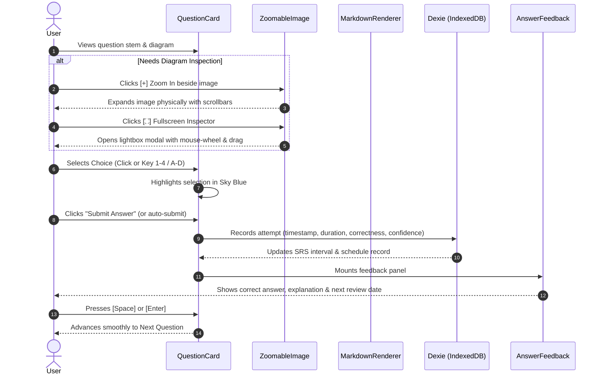

# SLACKR - UI & UX Design and Implementation Specification

> **Version**: 1.2.0  
> **Status**: Production Ready  
> **Target Audience**: Developers, Designers, and Technical Reviewers  
> **Core Mission**: Frictionless, offline-first exam review system for the Philippine National Information Technology Standards (PHILNITS / FE & AP) examination with zero-backend local execution, spaced repetition, and deep analytics.

---

## 1. Visual Language & Design System

### 1.1 Aesthetic Philosophy: "Cyber-Academic Focus"
SLACKR is tailored for long, intensive study sessions. The visual identity avoids eye strain while providing clear, instantaneous feedback on technical exam questions:

- **Deep Dark Canvas**: `#090d16` foundation with layered slate surfaces (`slate-950` for inputs and image frames, `slate-900` for cards, `slate-800` for sub-containers).
- **Subtle Glassmorphism**: Translucent card backdrops (`backdrop-blur-md bg-slate-900/90`) with delicate borders (`border-slate-800`) to create visual hierarchy without distraction.
- **Accents & Semantic Roles**:
  - **Sky Blue (`sky-400` / `sky-500`)**: Primary interactive color, active tab indicators, selected answers, question timers.
  - **Indigo / Purple (`indigo-400` / `purple-500`)**: Category tags, mock exam indicators, spaced repetition algorithms.
  - **Emerald Green (`emerald-400` / `emerald-500`)**: Correct answers, masteries, streak indicators, success states.
  - **Rose Red (`rose-400` / `rose-500`)**: Incorrect choices, error indicators, reset alerts.
  - **Amber (`amber-400`)**: Reset toggles, warning chips, caution badges.

### 1.2 Typography & Formatting
- **Body & Prompts**: Modern system sans-serif (`-apple-system, BlinkMacSystemFont, "Segoe UI", Roboto`) with relaxed line heights (`leading-relaxed`) for complex multi-paragraph stems.
- **Technical & Hex Elements**: Monospaced font (`font-mono`) for question IDs (`2026S_FE-A_6`), hexadecimal memory addresses, Assembly instructions, and timers.
- **Formulas & Math**: Full LaTeX rendering using **KaTeX** with `remark-math` and `rehype-katex` plugins. Inline math `$x$` and block equations `$$E = mc^2$$` render smoothly with crisp typography.

---

## 2. Component Architecture & Implementation Details

```
frontend/src/
├── components/
│   ├── Navbar.tsx             # Responsive global navigation with streak & review count
│   ├── QuestionCard.tsx       # Core study interface: stem, diagram, choices, timer
│   ├── ZoomableImage.tsx      # Diagram viewer with docked side buttons & fullscreen modal
│   ├── MarkdownRenderer.tsx   # Markdown + KaTeX parser (safe block container wrapping)
│   └── AnswerFeedback.tsx     # Immediate explanation, SRS interval badge, keyboard hint
├── pages/
│   ├── Home.tsx               # Dashboard with quick study triggers & recent activity
│   ├── QuizByYear.tsx         # PelNETS exam papers with "See all numbers" interactive grid
│   ├── QuizByTopic.tsx        # 3-tier taxonomy browser (Category -> Subtopic -> Topic)
│   ├── QuizCombined.tsx       # Full mock exam generator across multiple years
│   ├── QuizCustom.tsx         # Multi-criteria filtering (Year, Paper, Topic, Difficulty)
│   ├── QuizSpacedRepetition.tsx# SRS review queue (SM-2, FSRS, Custom algorithms)
│   ├── Analytics.tsx          # Weakness radar, streak heatmap, calibration curves
│   ├── QuestionHistory.tsx    # Filterable log of all past attempts and review intervals
│   └── Settings.tsx           # Offline sync status, cache management, algorithm selector
```

---

## 3. The Diagram Viewing & Zoom System (`ZoomableImage.tsx`)

PhilNITS exam questions regularly feature complex network schematics, assembly code traces, Karnaugh maps, and flowchart logic. Clear diagram inspection is critical to user success.

### 3.1 Previous Pitfalls & Why They Failed
1. **The Hover Jitter Loop**:
   - *Problem*: Original CSS used `hover:scale-[1.02]`. When the user's cursor crossed near the bounding edge of the image, the scale transformation enlarged the box, pushing the edge away from the cursor, triggering an un-hover $\to$ scale-down $\to$ hover $\to$ scale-up infinite oscillation loop ("bugging out").
   - *Fix*: Completely eliminated all `:hover` and `group-hover` transformations on images. Global rule in `index.css`: `img { transition: none !important; }`.
2. **Fixed-Crop Trapping (`overflow: hidden` + CSS `scale`)**:
   - *Problem*: CSS `transform: scale()` only changes the visual rendering layer; it does not expand the DOM layout box. In an `overflow: hidden` container, clicking `+` zoomed into the center and irrevocably cropped off the diagram's outer labels and text.
   - *Fix*: Replaced visual-only scaling with **true physical layout scaling** coupled with `overflow: auto`.
3. **Invalid DOM Nesting (`<p><div>`)**:
   - *Problem*: `react-markdown` wrapped custom image components inside `<p>` tags. Rendering a block-level zoom container with buttons inside `<p>` caused HTML parser tree splitting, breaking React click handlers.
   - *Fix*: Added a custom paragraph handler in `MarkdownRenderer.tsx` that detects image children and renders a clean `<div>` wrapper instead.

### 3.2 Current Implementation
- **Docked Side Button Column**:
  - The image container and the control column are wrapped in an `inline-flex` structure:
  ```tsx
  <div className="my-6 flex justify-center w-full">
    <div className="inline-flex flex-col sm:flex-row items-center sm:items-center justify-center gap-3.5 max-w-full">
      {/* Scrollable Diagram Frame */}
      <div ref={containerRef} className="max-w-full overflow-auto rounded-2xl border border-slate-700/80 bg-slate-950 p-3 shadow-xl" style={{ maxHeight: '72vh' }}>
        
      </div>

      {/* Control Buttons Beside It */}
      <div className="flex sm:flex-col items-center justify-center gap-2 p-2 rounded-2xl border border-slate-800 bg-slate-900/95 shadow-xl shrink-0">
        <button onClick={handleZoomIn} title="Zoom In (+)">[ + ]</button>
        <div>{Math.round(scale * 100)}%</div>
        <button onClick={handleZoomOut} title="Zoom Out (-)">[ - ]</button>
        {scale > 1 && <button onClick={handleResetZoom} title="Reset">[ ↺ ]</button>}
        <button onClick={() => setIsModalOpen(true)} title="Inspect">[ ⛶ ]</button>
      </div>
    </div>
  </div>
  ```
- **Physical Zoom Scaling**:
  - Scaling steps: $100\% \to 125\% \to 150\% \to 175\% \to 200\% \to 250\% \to 300\%$.
  - Image `maxHeight` scales proportionally (`440px` $\to$ `550px` $\to$ `660px` $\dots$).
  - `overflow: auto` ensures that when the diagram exceeds the container width, smooth native scrollbars appear, allowing the user to pan across the entire schematic without losing any text.
- **Fullscreen Inspector Modal (Lightbox)**:
  - Rendered via `createPortal(..., document.body)` to escape parent container clipping.
  - Interactive canvas: Mouse-wheel zooming ($50\%$ to $500\%$), pointer drag-to-pan, and keyboard shortcuts (<kbd>ESC</kbd>, <kbd>+</kbd>, <kbd>-</kbd>, <kbd>0</kbd>).

---

## 4. PelNETS Exam Hierarchy & "See All Numbers" Grid

### 4.1 Canonical PelNETS Sorting Rule
To maintain 100% fidelity to the PelNETS examination structure, questions are sorted strictly by:
$$\text{Year (2026}\to\text{2007)} \to \text{Season (Spring 0}\to\text{Autumn 1)} \to \text{Paper (FE-A 0}\to\text{FE-B 1)} \to \text{Question Number (1}\to\text{80 numerical)} \to \text{Subquestion}$$

Normalized season codes guarantee that legacy anomalies (e.g. `2015May_FE_*.md`) map correctly to `2015S`.

### 4.2 Interactive Number Pills Grid (`QuizByYear.tsx`)
Under every exam paper card and full mock session, users can expand the **`[ 🔢 See all numbers (Q1–Q80) ]`** panel:

```
+---------------------------------------------------------------------------------------+
|  [ 🔢 Question 1 of 80 ]   [ < Prev ]  [ Next > ]                     Progress: 65%   |
+---------------------------------------------------------------------------------------+
| Jump to Question Number:                                                              |
| [ 1 ] [ 2 ] [ 3 ] [ 4 ] [ 5 ] [ 6 ] [ 7 ] [ 8 ] [ 9 ] [ 10 ] ... [ 79 ] [ 80 ]        |
| (Emerald = Correct • Rose = Incorrect • Sky = Current • Slate = Unattempted)          |
+---------------------------------------------------------------------------------------+
```

#### UX Guarantees:
1. **Preserved Chronological Integrity**: Clicking question `#42` jumps directly to that question without filtering or reordering the paper. The Next/Previous buttons and progress bar continue sequential navigation (`41` $\leftarrow$ `42` $\to$ `43`).
2. **Attempt Status Color Coding**:
   - **Emerald (`bg-emerald-500/15 text-emerald-400 border-emerald-500/40`)**: Answered correctly in user's Dexie attempt history.
   - **Rose (`bg-rose-500/15 text-rose-400 border-rose-500/40`)**: Answered incorrectly in history.
   - **Sky Blue (`bg-sky-500 text-white shadow-sky-500/30 ring-2`)**: Currently active question.
   - **Slate (`bg-slate-900/60 text-slate-400 border-slate-800`)**: Unattempted.
3. **In-Quiz Navigation Drawer**:
   - The active quiz top bar contains a collapsible drawer toggle: `[ 🔢 Question X of Y ]`. Users can expand the full question grid mid-quiz to jump between questions instantly.

---

## 5. Question Interaction & Feedback Flow



### 5.1 Keyboard-First Ergonomics
SLACKR is built for high-speed review workflows:
- <kbd>1</kbd>, <kbd>2</kbd>, <kbd>3</kbd>, <kbd>4</kbd> or <kbd>A</kbd>, <kbd>B</kbd>, <kbd>C</kbd>, <kbd>D</kbd>: Select answer choice.
- <kbd>Space</kbd> or <kbd>Enter</kbd>: Submit selection or advance to next question when feedback is open.
- <kbd>ESC</kbd>: Close fullscreen image inspector or drawer.
- <kbd>+</kbd> / <kbd>-</kbd>: Zoom in / out in fullscreen inspector.

---

## 6. Offline-First Performance & Service Worker Architecture

### 6.1 Zero-Backend Guarantee
SLACKR is designed to function 100% autonomously in the browser without requiring a Python server:
- **Questions Database**: Pre-bundled static JSON file (`/data/questions_index.json`, 6.48 MB) containing all 3,609 questions from 2007 to 2026.
- **Local Persistence**: **Dexie.js** (IndexedDB) stores question attempts, confidence ratings, algorithm parameters, and user bookmarks locally.
- **Diagram Streaming**:
  - In development: Custom Vite middleware (`serveDiagramFiles`) streams diagrams directly from `backend/data/pelnets/Files` with appropriate MIME types.
  - In production / PWA: A Windows directory junction links `frontend/public/files` to `backend/data/pelnets/Files`.
- **Service Worker (`sw.js`) Strategy**:
  - **Local Development Bypass**: On `localhost`, `sw.js` unregisters itself and allows direct Vite HMR passthrough to eliminate stale-cache bugs.
  - **Production Cache**: `slackr-images-v2` caches diagrams on demand with strict `content-type: image` validation.

---

## 7. Spaced Repetition & Analytics UX

### 7.1 Multi-Algorithm Scheduling
Users can toggle between three spaced repetition models in **Settings**:
1. **SM-2**: Traditional SuperMemo 2 algorithm with Ease Factor ($1.3 - 2.5$).
2. **FSRS (Free Spaced Repetition Scheduler)**: Modern algorithm tracking Difficulty, Stability, and Retrievability.
3. **Custom Heuristic**: Error-penalty weighted interval calculation.
- **Replay Migration Engine**: Allows users to switch algorithms at any time; SLACKR replays their entire historical attempt log from Dexie and recalculates due dates with zero data loss.

### 7.2 Analytics Dashboard (`Analytics.tsx`)
- **Streak & Consistency Heatmap**: GitHub-style activity grid showing daily review density and streaks.
- **Confidence Calibration Curve**: Compares perceived confidence ($1$ to $5$) against actual accuracy to identify overconfidence or imposter syndrome.
- **Weak Spots Radar**: Identifies topics with $<60\%$ accuracy and provides a one-click **"Practice Weakest Questions"** trigger.

---

## 8. Summary of UI/UX Innovations

| Feature | Problem Solved | Implementation |
| :--- | :--- | :--- |
| **Physical Side Buttons** | Image hover zoom jittered and cropped technical diagrams. | `ZoomableImage.tsx` with dedicated side column buttons (`+`, `-`, `100%`, `↺`, `⛶`) and `overflow: auto`. |
| **"See all numbers" Grid** | Users could not pick specific question numbers without breaking sequence. | Collapsible pill grid in `QuizByYear.tsx` mapped to original chronological indices with Dexie attempt color coding. |
| **Mid-Quiz Drawer** | Long 80-question exams made jumping between numbers tedious. | `[ 🔢 Question X of Y ]` header toggle opening full jumping grid at any time. |
| **Zero-Backend Offline** | Complex setup required running Python and Vite simultaneously. | Static index bundle + Dexie.js + directory junction + Vite streaming plugin. |
| **Keyboard Ergonomics** | Answering questions with a mouse slowed down review velocity. | Full keyboard control: `1-4`/`A-D` to answer, `Space`/`Enter` to advance, `Esc` to close modals. |
